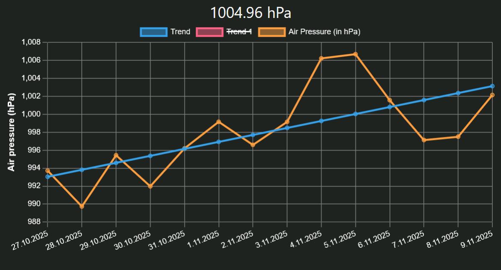

+++
title = "Becoming a Meterologist - Weather Station 101"
date = 2025-11-09T14:05:00+01:00
description = "Over the last few month I build a DIY weather station. Now, since 2 month or so later, it runs 24/7, posting measurements happy every 10min and pushing it to my dashboard. Here are my thoughts..."
+++

This is the (final) product🎉

In advance: I really underestimated the time I would need to finish the project. Material and soldering failure, unbelievable long delivery times and just my own faults in planning the project, summed up to a total of nearly 3 months. But it was really fun, seeing the pieces getting more and more together and eventually having a working weather station. Even though I have to admit, that I obviously didn't spend every day actively working on it, it is by far my most long-during project. And it is still not polished or finished. This is just a interim result: I plan on adding more sensors, for instance a rain gauge and an anemometer, and publishing the dashboard which is currently only reachable in the home network. Weird bugs and a not working over-the-air update implementation are also issues, I recently fight with.

Now lets dive into the more interesting part: How does the station work and what sensors are build in? The weather station is autonomous, powered by a monocrystal solar panel, which charges a battery pack with 5W, it should be 24/7 online. "Should" is here the right wording, because the days are getting again shorter, more cloudy, thus less power can be produced by the panel. Though the battery pack has a lot of capacity (3x3000mAh), more than enough to bridge a few days, I will see the actual uptime hours in the next weeks. 
To manage the incoming power, instead of cooking the ESP32, I decided to go with a solar power manager board, that sits between the microcontroller and the solar panel. It charges the batteries consistent and savely, watching out that they don't overcharge and eventually getting destroyed. At the same time, it continuously and steady provides the ESP its 5V.

So far, a BME280 measures temperature, humidity and air pressure. In order to ensure that no rain or long-term UV radiation destroys the sensor, it's enclosed by a Stevenson Screen, that, however, exposes the sensor to the surroundings. Consequently, is the sensor safe, but is still able to take valid measurements. 

Like mentioned before the weather station runs cyclically ever 10min. In the meantime, the ESP is in deep sleep to minimize its power consumption to roughly around 100µA. When wacking up, the ESP32 connects to WiFi, taking a measurement, cache it - to send later on an hourly overview -, publish it via a MQTT-subscription to my Broker (my Raspberry Pi), disconnects and shuts down again into deep sleep mode. Thereafter, a daemon writes the data to an InfluxDB bucket, where it is stored.

A dashboard, written with Typescript, NodeJS and Chartjs, visualizes then the data in an human-comprehendable form with graphs and gauges. It also shows air pressure, temperature and humidty trends, making it possible to predict (roughly) coming storms, low or high-pressure systems, as well as the weather behaviour for the next few hours.  
Perhaps, I expand these options with a small model, which predicts weather changes, based on the data of the weather station, but this truely lies in the future and doesn't have an as high priority as other more closer goals.

Here is a simple graph showing the history of air pressure over the last 14 days. You can’t see it anymore, but in Germany about three weeks ago, a large low-pressure system with a huge storm named “Joshua” arrived. The lowest measured air pressure was around 968 hPa. Since then, the weather has slowly been recovering — which you can still see on the graph.